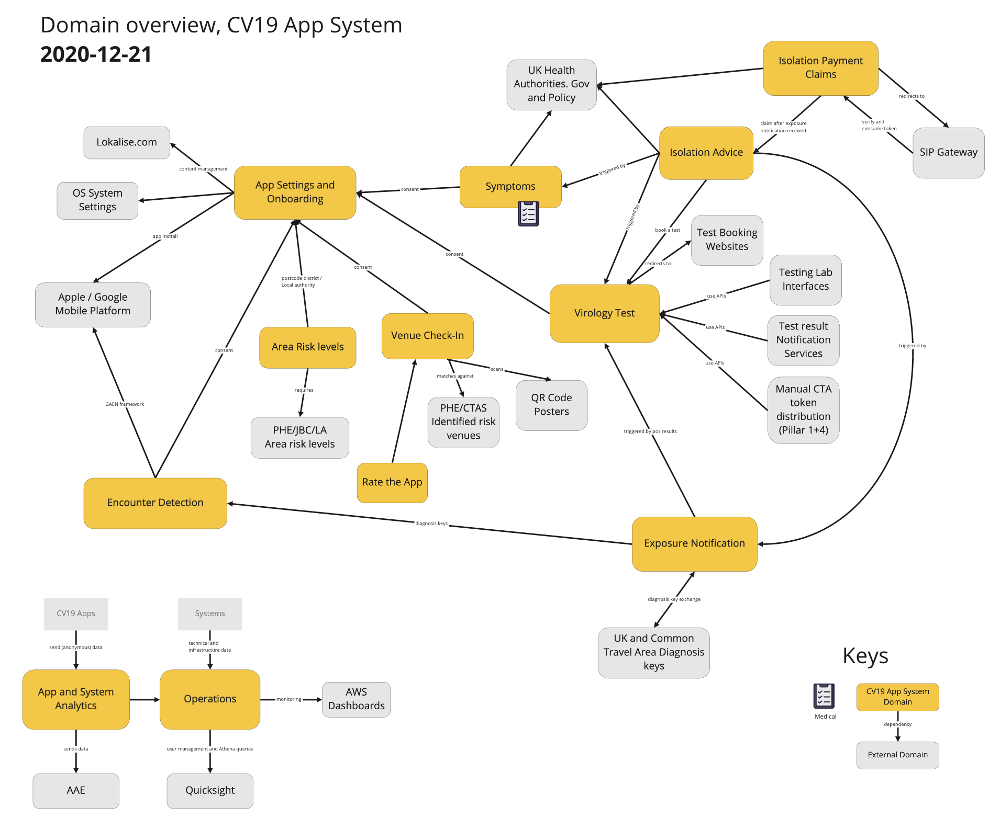
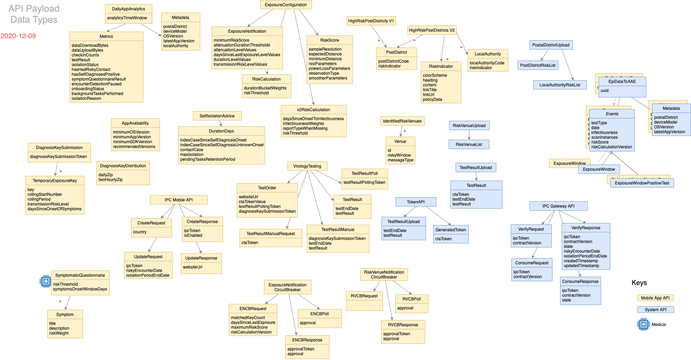
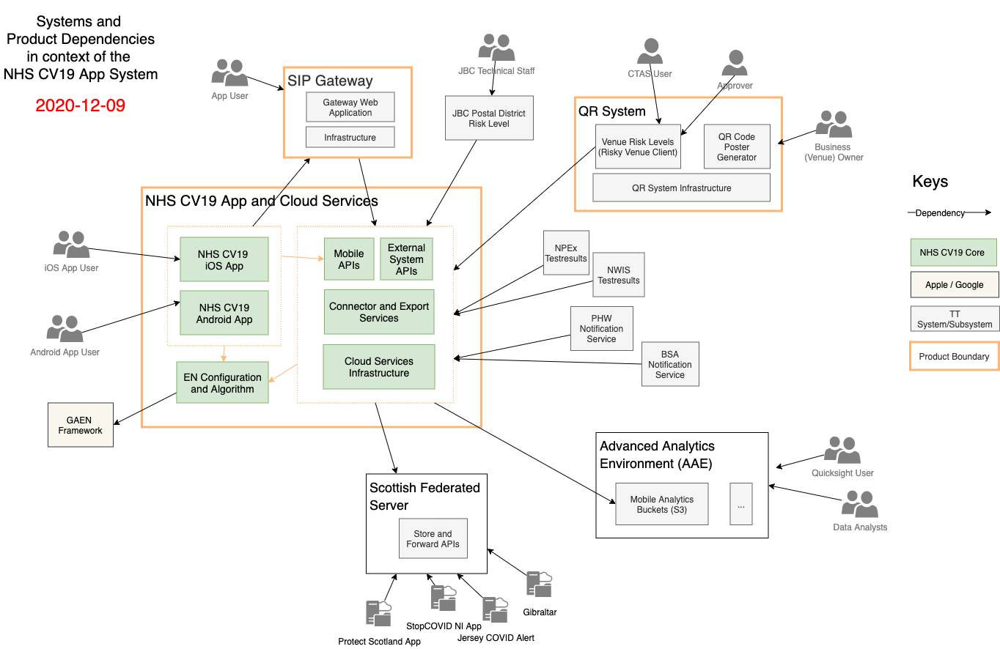
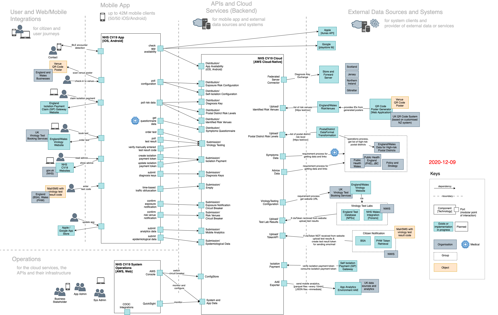
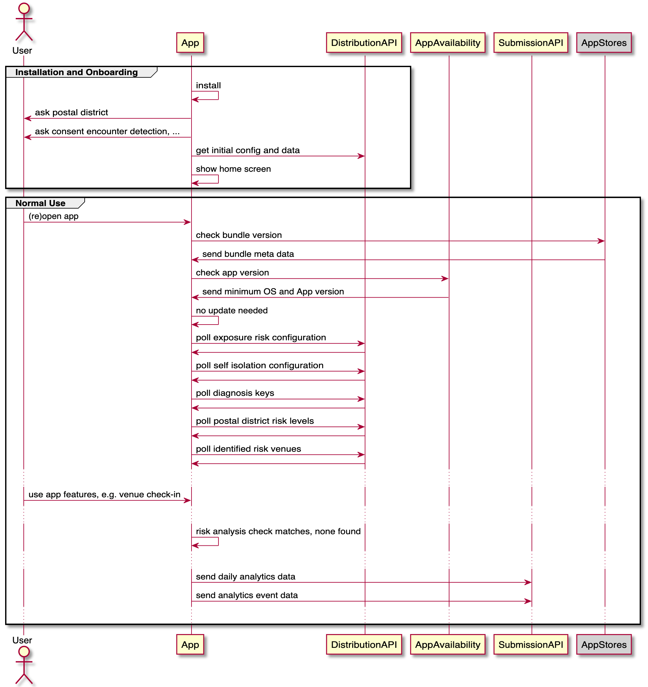
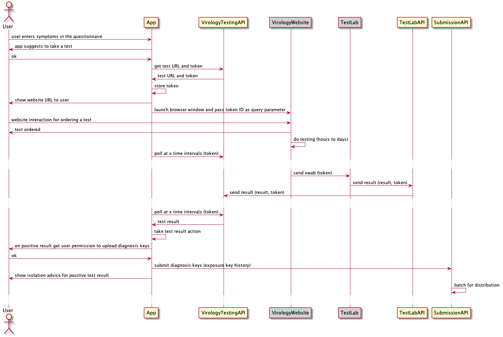
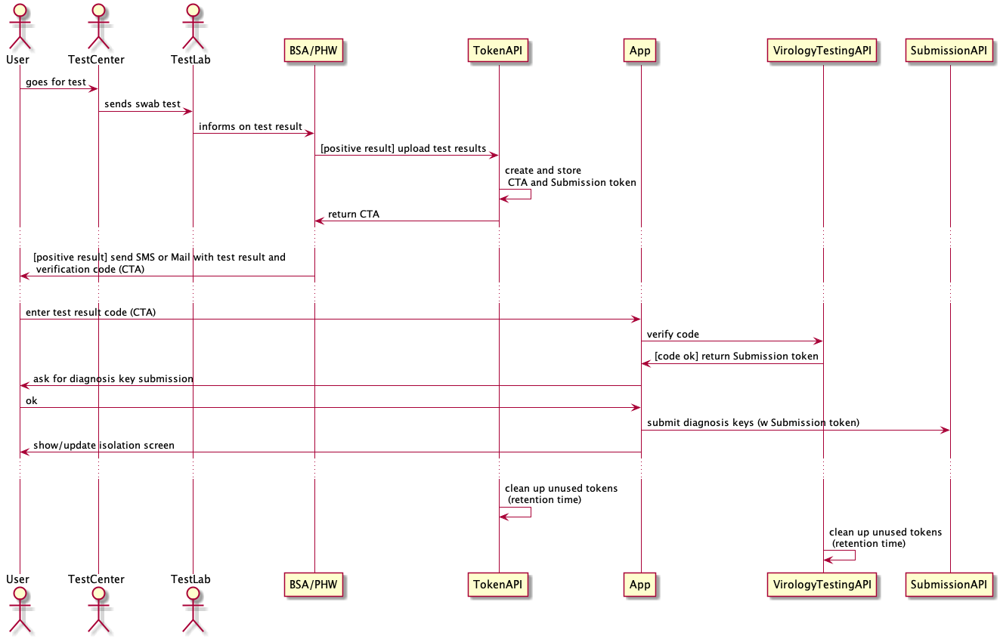
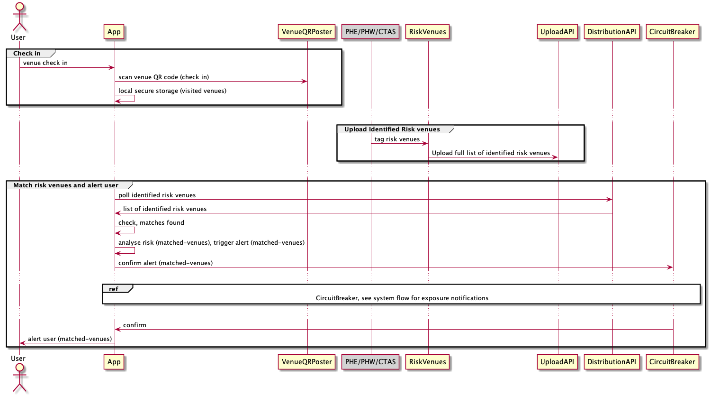
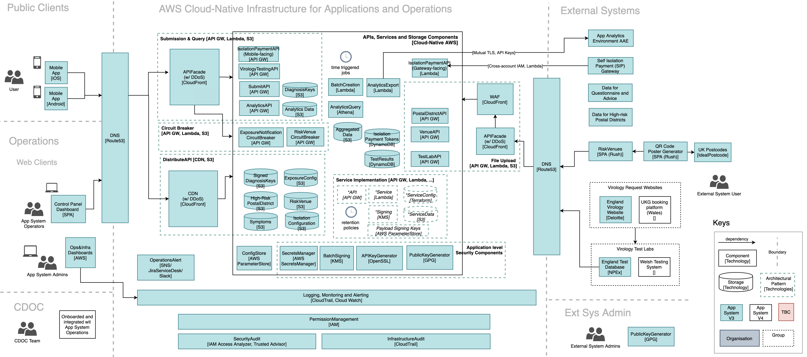

# NHS CV19 App System | Architecture Guidebook

This is a living guidebook and unique point of architectural reference for the NHS Test and Trace Application

## Table of Contents

* [Context](#context)
* [Functional Architecture](#functional-architecture)
  * [Domain Model](#domain-model)
  * [Data Model](#data-model)
  * [GAEN Framework](#gaen-framework)
* [System Overview](#system-overview)
* [System Architecture](#system-architecture)
* [System Behaviour](#system-behaviour)
* [System APIs and Interfaces](#system-apis-and-interfaces)
  * [Submission](#submission)
  * [Distribution](#distribution)
  * [Upload](#upload)
  * [Circuit Breaker](#circuit-breaker)
  * [Connector](#connectors-and-exporters)
* [Tech Stacks and Repositories](#tech-stacks-and-repositories)
* [Infrastructure](#infrastructure)

## Context

The Test and Trace Application is about speed, precision and reach in context of the overall Test & Trace program. It triggers isolation advice in minutes, provides measurements of time and approximated distance and notifies who you met, while protecting your privacy.

* Trace: Get alerted if you’ve been near other app users who have tested positive for coronavirus.
* Alert: Lets you know the level of coronavirus risk in your postcode district.
* Check-in: Get alerted if you have visited a venue where you may have come into contact with coronavirus.
* Symptoms: Check if you have coronavirus symptoms and see if you need to order a free test.
* Test: Helps you book a test and get your result quickly.
* Isolate: Keep track of your self-isolation countdown and access relevant advice.

## Functional Architecture

The CV19 App System is a composition of different functional, technical and organisational domains, related to each other by different app user journeys, from left to right, clock-wise:



### Domain Model

Our concepts include terminology of the GAEN framework. Please see the [GAEN API](https://static.googleusercontent.com/media/www.google.com/en//covid19/exposurenotifications/pdfs/Android-Exposure-Notification-API-documentation-v1.3.2.pdf) for detailed data models and concept definitions.

* **Encounter detection** provides temporary exposure key histories for index cases
* **App Settings and Onboarding** for multiple languages and user specified postcode districts
* **Diagnosis keys** are polled periodically from the backend and then matched on mobile client side using the GAEN API as part of the Apple / Google mobile platforms
* **Symptoms** trigger Isolation Advice, but **not** a diagnosis key upload
* **Isolation advice** offers **ordering a test**
* **Isolation advice** triggered by **Exposure Notification** offers **claiming an isolation payment**
* Based on a positive **Virology test result**, diagnosis key upload with exposure notification and/or index case advice is (re)triggered
* Lists of venues identified by public health organisations as risk venues are polled and matched with information from Venue QR codes scanned by the app's **Venue Check-In**.
* High risk postcodes as an example of certain **Area risk levels** are polled and matched with the user specified postcode district
* **User Notifications** can be triggered by either risky venues with the visited venues, or area risk level with the user specified postcode district level
* The important **difference between User and Exposure Notification** is that the latter always and only refers to diagnosis key matches for the contacts of an index case (cascading). User notifications in contrast are triggered only by and for user owned data like postcode districts or QR codes of visited venues.
* **App and System analytics** is the one and only domain getting anonymised usage or installation related data. Design and implementation addresses in particular all privacy and security concerns of NCSC, the ICO and the GAEN Framework T&Cs.

### Domain Dependencies

* Encounter detection depends on the Apple / Google mobile platform, user devices with their iOS and Android OS and their implementation of the GAEN Framework.
* Symptoms, Isolation advice and the Isolation payment claims depend on approved policies and data from UK health authorities and government.
* Virology testing depends on UK test booking web sites. And testing labs with their specific organisation, processes and technical interfaces, test result notification services and processes for manual token distribution depend on APIs provided by that domain
* Venue Check-In depends on the QR system with the two components for generating QR Posters and for labelling venues as a risk venue (used by PHE, CTAS)
* Import of area risk levels depends on corresponding CV19 related data sources from PHE, JBC and Local Authorities

### Data Model

The following data model provides a black box view on the system's data model. It uses the payload specifications of our [API contracts](#system-apis-and-interfaces).



### GAEN Framework
Background and an explanation of the framework's basic functionality can be found [here](https://blog.google/documents/73/Exposure_Notification_-_FAQ_v1.1.pdf)

The app launched using the Google and Apple Exposure Notification (GAEN) API version 1 (known as version 1.4 on Android) and, as of release v3.9,
the app has been updated to support version 2 (version 1.6+ on Android). iOS 13.5 and 13.6 don't currently support version 2 of the GAEN API and hence we have to support
both versions in production.

#### Core behaviour
At their core, both versions of the API function the same way and the basic flow is simple. When a user receives a positive
test result they are prompted to share their keys with the central server. These keys are then bundled into key files and at
regular intervals other users apps will download these key bundles and compare the contained keys with the keys they've interacted
with in the last 14 days. In the event that the downloaded key bundle contains one or more keys that have previously been
received by the API then the app calculates a risk score for the encounter with the key. If this risk score exceeds a certain
threshold then it will advise the user to self isolate and order a test.

#### GAEN API version 1/1.4
This is the original version of the GAEN API and is the version that was used by the app at initial launch. Many of the
methods and objects associated with v1 are now marked as deprecated, and we have moved to v2 in v3.9 of the app, however we still
use the v1 methods as a [fallback on iOS](#fallback-behaviour) when the v2 OS requirements are not met.

##### Downloading keys
In v1, calls to provide keys to the GAEN API are limited to 20 per day. In the initially released version of the app which uses v1,
the app schedules a background task to run every 2 hours to download any new bundles of keys and provide them to the GAEN API.

> NOTE: This background task behaviour is specific to versions < 3.9 of the NHS COVID-19 app, and not v1 of the GAEN API.

The API then checks if any of the newly downloaded keys match with the keys the device has encountered and stored locally. If there is
a match, we then request further information about the encounter.

In v1, we use the [`ExposureInformation`](https://developers.google.com/android/exposure-notifications/exposure-notifications-api#exposureinformation) 
object to receive further details about a particular encounter which we can then use to calculate a risk score. Calling the method to
[get `ExposureInformation`](https://developers.google.com/android/exposure-notifications/exposure-notifications-api#getexposureinformation)
causes the GAEN API to display a notification to the user alerting them of a possible exposure. The app then uses the calculated
risk score to determine whether the encounter is risky.

##### Risk scoring
The [config](../../src/static/exposure-configuration.json) provides values `attenuationDurationThresholds`
to the GAEN API to denote the BLE 'attenuation buckets' edges. For a given encounter, the corresponding `ExposureInformation`
details the amount of time spent in the three attenuation buckets - 'near', 'medium', and 'far'. The config also defines
a weight for each of these buckets and thus the risk score can be calculated by multiplying the sum of the weighted attenuation
bucket durations with the infectiousness factor.
 
##### Infectiousness via `transmissionRiskLevel`
The infectiousness of an individual is higher the closer they are to their onset of symptoms. The app makes use of the
`transmissionRiskLevel` field to encode information about the infectiousness level of the individual which is used to 
calculate the aforementioned infectiousness factor of the risk score calculation.  

When the app uploads keys (due to a positive test result) we augment the key with the `transmissionRiskLevel` field, which
we set to reflect the days between the day the key was in use and when symptoms started. However, the field is limited by
the API to only accept values in the range 0-7 so we can't just set the difference in days. For a given key i,
where the maximum risk level R<sub>max</sub>=7 and d<sub>i</sub> is the number of days since onset of symptoms that key i was created,
transmission risk level r<sub>i</sub> is calculated as follows:


We can then use this value on receipt of a key to calculate an infectiousness factor using an equation derived from equation
3 in [Risk scoring for the current NHSx contact tracing app](https://arxiv.org/pdf/2005.11057.pdf).

Because we cannot send negative values, we choose to remove μ<sub>0</sub> and thus the curve is symmetrical and centred around 0.
So, with abs(d<sub>i</sub>)=R<sub>max</sub> - r<sub>i</sub>, σ<sub>0</sub>=2.75 the formula for infectiousness factor (I<sub>i</sub>) on encounter with key i is:


The curve for which looks like this


#### GAEN API version 2/1.6+
Version 2 of the API functions much the same as version 1, but when evaluating the risk associated with a contact the API
provides time series data (known as `ScanInstance`s) for the duration of the contact (know as an `ExposureWindow`).

A more detailed breakdown on the data structures available from the v2 API can be found in the [GAEN documentation](https://developers.google.com/android/exposure-notifications/exposure-notifications-api#data-structures).

##### Downloading keys
In version 2 of the GAEN API keys can only be provided to the API to check for contacts 6 times per day, this is a significant
reduction from the 20 times per day limit that existed for version 1, but it does also come with the ability to pass in 
multiple keys files as part of 1 call. 

This is an improvement over version 1 in terms of initial setup, as it means that when the app is freshly installed, you are
able to 'catch up' on the past 14 days of key files in one call to the API, rather than making calls till you hit the rate limit.
However, because older builds of the app expect to pull down a new key file every 2 hours, key bundles are created at the same
rate and if the version 2 compatible app tried to consume files at this rate, it would hit the rate limit early on each day.

To deal with this limitation the app downloads key files at most, once every 4 hours. When the app moves to download files
it pulls down all key files between the last downloaded file and now and supplies all of them to the API in one call.

##### Risk scoring
The time series data provided by the v2 GAEN API allows us to use a more sophisticated algorithm for risk scoring than the one used in v1.
A top-level description of this algorithm follows, whilst a more detailed explanation can be found in this [paper](https://arxiv.org/abs/2007.05057). 

In version 2, a contact is (roughly) encapsulated as an `ExposureWindow`, this window contains time series data for exposure
as a number of `ScanInstance`s. Each `ScanInstance` stores information about the sighting of beacons from a diagnosis key
within a BLE scan (typically of a few seconds). A risk score is calculated for each `ExposureWindow` by feeding the `ScanInstances`
into an Unscented Kalman Smoother. 

We then multiply the risk score generated from the `ExposureWindow` by an [infectiousness factor](#infectiousness) and 
compare that score to a given risk threshold to decide if a contact was 'risky' or not.

##### Infectiousness
Infectiousness in v2 is less granular than our infectiousness implementation on v1, as the API provides only 3 levels of infectiousness
`NONE`, `STANDARD` and `HIGH`. Each `ExposureWindow` will have a value for infectiousness, which is worked out by setting a 
mapping of the difference between the day the `ExposureWindow` was recorded and symptoms began to a level of infectiousness.
The current mapping is:

| Days since onset | Infectiousness level
|------------------|----------------------
| < -5             | `NONE`               
| -5 to -3         | `STANDARD`           
| -2 to 3          | `HIGH` 
| 4 to 9           | `STANDARD` 
| \> 9              | `NONE` 

When an app uploads keys (due to a positive test result) we augment the key with a `daysSinceOnsetOfSymptoms` field which
records how many days there were between the date this key was in use, and the user began to suffer from symptoms.

It should be the app's responsibility to define a default infectiousness level for the situation where `daysSinceOnsetOfSymptons` isn't set for a key.
However, there is an existing bug in the iOS implementation of the GAEN API which means the mechanism to supply this default value does not work. 
This bug is due to be fixed as part of iOS 14.2 which at the time of writing is not released. In order to deal with being unable to set a default value in app,
the system's backend attaches a default `daysSinceOnsetOfSymptoms` of 0 to keys without the field whilst building bundles for distribution.

When evaluating the risk for a contact, we convert the infectiousness level into an infectiousness factor which is used in the
risk scoring calculation (see the Risk Scoring section above). The current mapping of infectiousness level is based off the 
following diagram.


And the following values are used.

 | Infectiousness level | Infectiousness Factor
 |----------------------|----------------------
 | `NONE`               | 0.0        
 | `STANDARD`           | 0.4          
 | `HIGH`               | 1.0 

##### Cached keys
Keys that have been supplied to the API are now cached, so whenever you get a new match you also get the chance to re-evaluate
matches from the last 14 days. This means that changes to the `riskThreshold` can be applied to contacts that were originally
considered under the previous threshold, as long as they haven’t expired.

##### Fallback behaviour
On Android devices, the installed version of the GAEN API is dictated by the installed version of Google Play Services.
Devices which have a version of Play Services older than 1.6 will continue to use the v1 GAEN API.

On iOS devices, the installed version of the GAEN API is dictated by the installed version of iOS. Version 3.9 of the app,
where the v2 risk scoring methods are introduced, will fallback to v1 for risk score calculation on devices which have an iOS
version older than 13.7.

It's worth noting that if the app falls back to using version 1 of the GAEN API, it will still only download key files every
4 hours.

## System Overview

The NHS CV19 App and Cloud Services (CV19 App System)  has five major parts: Mobile apps, Cloud backend with API services, Infrastructure, Exposure Notification (EN) configuration and algorithm, and Dependent systems.



It adheres to following principles

1. No User State or Identifier is stored on the Cloud Services
1. All APIs are stateless where possible
1. When stateful behaviour is required, short-lived tokens are used as identifiers. They exist only as long as they are needed
1. Mobile analytics are collected, completely anonymously. A user’s IP addresses will not be stored by the functional App System
1. External system integration follows an API-first approach

Note, that on the technical layer HTTPS is used, where Internet Network Providers typically transfer IP-addresses between technical endpoints such as mobile device and the Web Application Firewalls of the AWS cloud services. However, we do not store any of these in the App System's backend.

## System Architecture

The system architecture diagram below specifies the complete system showing the main system components with their communication ports, and integrations within each other:

* Android and iOS native mobile apps implement the user-centric vision of the Test and Trace application. We use the EN Framework provided by Apple and Google to implement encounter detection based on BLE attenuation duration.
* APIs and Cloud Services (Backend) are implemented using an AWS cloud-native serverless architecture and provided to mobile clients as APIs. For the implementation of the services we use AWS Lambdas.
* The integration of external systems is implemented by the backend, again following an API-driven approach for all provided interfaces. For exporting or providing data there are connector or exporter implementations, again using AWS Lambdas.
* As part of Operations, web clients for smaller internal user groups and stakeholders are implemented as SPAs (single page applications), predominantly React, which could be hosted on S3.
* Security and operations is built on AWS cloud-native components.



The port names in the system architecture are usually defined by ```API Group\API Name```, e.g. ```Submission\Diagnosis Key```.

## System Behaviour

System flows describe the behavioural interactions between the app, the backend services, the external systems and the monitoring and operation components. They **do not describe interactions within a single system component** like an app user interacting with only mobile app.

### Installation, configuration and normal use

This is the flow on first app install, and in normal use when the app is collecting exposures and QR code check-ins and checking these against distributed positive diagnosis keys, identified risk venues and high-risk postcodes.



On **first install and when the app is opened** after it has been closed completely on the mobile device, it checks version availability with our backend service as well as the Apple and Google app stores. This check then may notify the user of mandatory or optional available app updates. It also allows to deactivate all but the availability check functionality, hence acting as a kind of "kill switch".

After that it downloads and applies the following **configurations**:

* Exposure Configuration (Apple Google EN Framework) for encounter detection and exposure risk computation
* Self-Isolation Configuration for isolation time intervals

It then periodically downloads and uses data, retrieved from  **data distribution** APIs:

* Diagnosis Keys
* Postal District Risk Levels
* Identified Risk Venues
* Data and structure for the Symptoms Questionnaire

On a daily basis the app will submit anonymous **mobile analytics** data:

* Technical static data: OS and app version, and the device model
* Technical dynamic data such as cumulative bytes of data uploaded/downloaded and the number of completed background tasks
* App usage related data on
  * Onboarding
  * Venue Check-Ins
  * Symptoms Questionnaire
  * Test results
  * Isolation

In addition, the app will submit anonymous **mobile analytics events** data to enable AAE to determine the epidemiological effectiveness of encounter detection:
* [ExposureWindow](https://developers.google.com/android/exposure-notifications/exposure-notifications-api#exposurewindow) data

The analytics data is stored in the backend without any reference to the submitting device or app installation.

### Matching diagnosis keys trigger exposure notification

This is the flow when a diagnosis key match is found. A ‘Circuit Breaker’ is a backend service to control alert or notification decisions, so a scenario where a whole city is told to isolate can be identified and action taken before it occurs. 


The **risk analysis** is performed by a collection of algorithms within the app, using all available data and the configuration retrieved from the backend. There is no personal data in the backend that are needed as part of the risk analysis.

If risk analysis results in an action trigger, this must be **confirmed with the Circuit Breaker** backend service. The API may need time to decide what action to take (as it needs to see what other app user actions are pending, and get human input) hence it never makes an immediate response. Rather it generates a short-lived token and returns this reference to the app for it to ask for updates. The app will periodically poll the server for a decision, driven by the backgrounding schedule of the app.

For the Isolation advice please note, that no identifiable user state is stored within the cloud services. When we have asked a user to take an action all record of this is held on the app.

### Symptoms questionnaire, booking a test and getting result using a temporary token

This is the flow that is taken when the app recommends to a user that they take a Virology test after having entered symptoms in the questionnaire.

Wenn the user interacts with the symptoms questionnaire, the App has the latest symptoms configuration and a mapping from symptoms to advice which is then shown to the user. With the advice there is an option to order a test and a start of the isolation countdown. The countdown is not synchronised with the backend, so in case the device is wiped or lost, thre is no means to recover the isolation state for that user.

The testing process involves ordering and registering tests through the UK  Virology Testing website, which is external to the App system. Note the flow step for actual Virology Testing is a horribly over-simplified view of a complex process outside of our system.



The app generates a short-lived **token to pass to the Virology Testing website** so that it can match the results that come back a few days later. This token is generated as unique by the Backend Service. The Backend service will store the token so that it can confirm the results that it is sent are valid.  

The app will sporadically poll the Virology Testing API to see if the test result is available. If the test result is negative no further action is taken.

As per the flow for an Exposure Notification, when an app user is confirmed positive they are asked to submit their keys for inclusion in the diagnosis keys distribution set.

### Receive test result token via Mail or SMS and enter into app for diagnosis key submission

This is the flow where the App user manually enters a test result code, received via SMS or Mail from the citizen notification service: BSA for England and PHW for Wales. 



The notification service uses an App System API to upload the test result **and** get a test result verification token. The token is then send via SMS/Mail to the citizen together with the result so she can verify the test result with the app and submit diagnosis keys for contact exposure notifications.

### Venue check in, matching identifed risk venues and alert user

The venue check-in flow shows how idenitfied risk venues are imported from external systems, matched in the App against visited venues and then may trigger a corresponding notification for the App user.  



## System APIs and Interfaces

The Cloud Services ports in the system architecture are implemented by API services and Interfaces, grouped into a small number of fundamental concepts and architectural patterns:

* Mobile **data submission** to backend
* **Distribution of data and configuration** to mobile apps
* **Circuit breaker** for specific app user notifications
* **External systems data** by file upload to backend
* **Connectors and exporters** to external systems
* **Dashboards** for monitoring
* Application level **security**

The following solution patterns take characteristics of these groups into account. The patterns are applied in [specific API contracts](./api-contracts), provided by the cloud services backend and consumed by mobile or external systems. We use an API specification by example approach based on semi-formal .md files.

### Foundations and Security
All APIs adhere to the following **structure and foundational features**

* Basic endpoint schema: ```https://<FQDN>/<api-group>```
* `FQDN`: Hostname is different per environment. It is prefixed by the API group, e.g. for `submission-` you'll get ```https://submission-<host>/<api-group>```
* We provide API endpoints in different environments from test to prod, to support joint integration testing
* APIs have rate limits, see general information on [AWS API GW rate limits](https://docs.aws.amazon.com/apigateway/latest/developerguide/api-gateway-request-throttling.html)

#### Security and authentication for external system access via Upload or Submission

* Cloudfront presents SSL certificate with our host name in it, pinned on the root certificate(s) of the chain for our mobile app
* TLS 1.2 (tls1.2_2018 policy) is used for connection encryption
* [Authorisation with API Key](./api-contracts/security.md#authentication) specially issued for each API: ```Authorization: Bearer <API KEY>```
* Secure process for generating and distributing API Keys relies on out-of-band identity authentication:
  1. We generate and exchange GPG public keys and establish a trust relationship (e.g. phone call) with third party (ext system responsible)
  1. We generate the API key using the third-party's public key, encrypt and send it via mail
* IP range restrictions: API access is restricted to a single IP or a range of given IP addresses
* Our process for IP range restrictions requires exchange of to be used IP addresses/ranges with our Operations & Infrastructure team
* Authentication secrets are not stored anywhere except in the opaque auth header, which is distributed to the respective client application with end-to-end encryption.
* Note that details of the particular security implementation may differ from dev to prod

#### Signature of responses via Submission and Distribution

The majority of APIs in the submission and distribution API groups will include a HTTP header containing a signature to support verification of payloads.
  * [Signature (ECDSA_SHA_256) of response body](./api-contracts/security.md#response-signature): ```x-amz-meta-signature: keyId="(AWS ACM CMK key id)",signature="(base64 encoded signature)"```
  * One Signing Key #1 for all APIs
  * Public Key #1 embedded into mobile apps (in obfuscated form)
  * Clients (mobile apps) must verify signature

There are some exceptions (such as analytics events) where a signature is not provided because the consumption of the body is not required (e.g. because it is empty).

No response signatures are provided for external facing APIs (not consumed by mobile).

#### Signature of diagnosis keys distribution

In addition to the signature header, the payload for diagnosis keys distribution also contains a signature that follows the Apple and Google specification and is required for the exposure notification API to function correctly on the mobile.
  * Signed "by design"
  * One Signing Key #2 for Diagnosis Key distributions
  * Public Key #2 sent to Apple and Google

#### Generic HTTP response codes

If not stated differently all APIs use the following **default HTTP response codes**

* `202` if uploaded file successfully processed, response text similar to `successfully processed`
* `403` forbidden (API key invalid), response text similar to `authentication error: <summary, no details>`
* `422` file validation errors, response text similar to `validation error: <details>`
* `429` API GW rate limit, response text similar to `too many requests: <summary, no details>`
* `500` internal errors, response text similar to `internal error: <summary, no details>` 
* `503` service in maintenance mode (point-in-time data recovery in progress)

Be prepared for the unpredictable: the cloud services we use (CloudFront, API Gateway, etc.) can return other HTTP error codes in certain error situations. API clients must therefore be prepared for unexpected HTTP error codes in their error handling strategy. We generally recommend that all API clients have a retry strategy with exponential backoff.

### Submission

Submission APIs are usually used by the app to submit data to the backend.

* Endpoint schema: ```https://<FQDN>/submission/<payload type>```
* Payload content-type: application/json
* Authorisation: ```Authorization: Bearer <API KEY>```
* One API KEY for all mobile-facing APIs

Note, the port name in the system architecture is defined by ```API Group\API Name```, e.g. ```Submission\Diagnosis Key```.

| API Name | API Group | API Contract | User/Client impact |
| - | - | - | - |
| Diagnosis Key | Submission | [diagnosis-key-submission.md](./api-contracts/diagnosis-key-submission.md) | In event of positive diagnosis the app can upload anonymous exposure keys to the server |
| Virology Testing | Submission | [virology-testing-api.md ](./api-contracts/virology-testing-api.md) | Allows clients to book a coronavirus test using a CTA Token that is passed into the test booking website. Clients can also periodically poll for test results using the CTA Token. New for v3.3 - clients can request a result for a test that was not booked via the app, they will input a CTA token into the app. |
| Mobile Analytics  | Submission | [analytics-submission.md](./api-contracts/analytics-submission.md) | Allows clients to submit analytics data daily. Not testable from mobile application. |
| Mobile Analytics Events | Submission | [mobile-analytics-submission.md](./api-contracts/mobile-analytics-submission.md) | Allows clients to send anonymous epidemiological data to the backend. |
| Isolation Payment | Submission | [isolation-payment-mobile.md](./api-contracts/isolation-payment-mobile.md) | Allows clients to request isolation payment using a IPC Token that is passed to the isolation payment website. |


### Distribution

* Endpoint schema: ```https://<FQDN>/distribution/<payload specific>```
* `FQDN`: One (CDN-) hostname for all distribute APIs
* HTTP verb: GET
* Payload content-type: payload specific

| API Name | API Group | API Contract | User/Client impact |
| - | - | - | - |
| Diagnosis Key | Distribution | [diagnosis-key-distribution.md](./api-contracts/diagnosis-key-distribution.md) | Clients download exposure keys everyday, valid for 14 days (as per EN API). |
| Exposure Risk Configuration | Distribution | [exposure-risk-configuration-distribution.md](./api-contracts/exposure-risk-configuration-distribution.md) | N/A not testable. |
| Postal District Risk Levels | Distribution | [risky-post-district-distribution.md](./api-contracts/risky-post-district-distribution.md) | List of post districts with risk indicators, used by mobiles to match against the user specified postal district. |
|  |  | [risky-post-district-distribution-v2.md](./api-contracts//risky-post-district-distribution-v2.md) |  Additional app color and content information for risk level indicators. |
| Identified Risk Venues | Distribution | [risky-venue-distribution.md](./api-contracts/risky-venue-distribution.md) | List of venues marked as risky which mobile clients poll for daily. If the client has been in a risky venue within the risk period (defined in risky venue upload) an isolation message is displayed. |
| Symptoms Questionnaire | Distribution | [symptoms-questionnaire-distribution.md](./api-contracts/symptoms-questionnaire-distribution.md) | Symptomatic questionnaire used in the mobile clients. This is set by the NHS Medical Policy team. |
| Self Isolation Configuration | Distribution | [self-isolation-distribution.md](./api-contracts/self-isolation-distribution.md) | Configuration data used by mobile clients to inform users how long to isolate for and how far back they can select symptom onset. |
| App Availability | Distribution | [app-availability-distribution.md](./api-contracts/app-availability-distribution.md) | Distribute required OS and app versions (req version > existing => deactivates app) |

### Upload

Upload APIs are usually used by external systems to submit data (files, json) to the backend.

* Endpoint schema: ```https://<FQDN>/upload/<payload type>```
* Payload content type (HTTP header): application/json or text/csv
* Payload size restriction: < 6MB
* All-or-nothing: No partial processing (no row-by-row processing)
* Fast-fail: stop processing after first validation exception
* API GW Rate limit (can be periodically adjusted): 100-150 RPS, max concurrency of 10
* Security for external system upload

| API Name | API Group | API Contract | User/Client impact |
| - | - | - | - |
| Postal District Risk Levels | Upload | [risky-post-district-upload.md](./api-contracts/risky-post-district-upload.md) | Distribution to mobile. |
| Identified Risk Venues | Upload | [risky-venue-upload.md](./api-contracts/risky-venue-upload.md) | Data source for Risky Venue distribution API. |
| Test Lab Results | Upload | [test-lab-api.md](./api-contracts/test-lab-api.md) | Data source for Virology Testing API allowing mobile to poll for test result. |
| Token API  | Upload | [token-api.md](./api-contracts/token-api.md) | Data source for CTA token when test outside of the app has been undertaken. Mobile app allows entry of CTA token to confirm receipt of the test outcome. |

### Circuit Breaker

Circuit breaker APIs delegate the decision for a risk-based action (e.g. advice self-isolation on exposure notification). The mobile client indicates to the corresponding service that a risk action is to be taken and receives a randomly generated token.

* Endpoint schema: ```https://<FQDN>/circuit-breaker/<risk type specific>```
* HTTP verb: POST
* Payload content-type: application/json
* Payload: related context information (a simple JSON dictionary, i.e. key-value pairs)
* Authorisation: ```Authorization: Bearer <API KEY>```
* One API KEY for all mobile phone-facing APIs

After receiving the token the mobile client polls the backend until it receives a resolution result from the backend.

| API Name | API Group | API Contract | User/Client impact |
| - | - | - | - |
| Exposure Notification Circuit Breaker | Submission | [exposure-notification-circuit-breaker.md](./api-contracts/exposure-notification-circuit-breaker.md) | Manual circuit breaker to stop exposure notification alerts in mobile clients on positive diagnosis after client uploads keys. |
| Risk Venues Circuit Breaker | Submission | [risky-venue-circuit-breaker.md](./api-contracts/exposure-notification-circuit-breaker.md) | Manual circuit breaker to stop exposure notification alerts in mobile clients after a venue is marked as risky from the upload API. |

### Connectors and Exporters

| API Name | API Group | API Contract | User/Client impact |
| - | - | - | - |
| Federated Server Connector | Connector | [diagnosis-key-federation.md](./api-contracts/diagnosis-key-federation.md) | Up/Download federated diagnosis keys. |
| AAE Exporter | Exporter | [mobile-analytics-events-aae.md](./api-contracts/mobile-analytics-events-aae.md) | Export analytics data. |

## Tech Stacks and Repositories

The [system repository](https://github.com/nhsx/covid19-app-system-public) includes the implementation of all services required to collect data and interact with the mobile devices and external systems
and the code to automate build, deployment and test of the services. The **APIs and Cloud Services** are implemented using

* Run: AWS and Java
* Build and Deploy: Ruby and Terraform
* Test: Robot Framework (Python), JUnit/Kotlin

The AWS cloud-native implementation uses API gateways acting as a facade for serverless functions with mostly S3 buckets for storage. The services are configured using Terraform source code files. Payloads are signed using KMS. Some patterns require more DB like persistence where we use DynamoDB. Finally some services and storage components require time triggers or time related functions and AWS features such as retention policies for S3 buckets.

Note that our build system and deployment architecture is currently used only internally. We add documentation to the open source repository as soon as these internal components for development and delivery become relevant for public development.

The **iOS app** only uses standard Apple tooling, all bundled within Xcode.

* [Application source code](https://github.com/nhsx/covid-19-app-ios-ag-public)
* [Architecture and module definitions](https://github.com/nhsx/covid-19-app-ios-ag-public/blob/master/Docs/AppArchitecture.md)
* [Internal and external dependencies](https://github.com/nhsx/covid-19-app-ios-ag-public#dependencies)

The **Android app** uses standard Android tooling, Kotlin and Android SDK. The build uses Gradle with a couple of third party Gradle plugins for publishing and protobuf (only for field test).

* [Application source code](https://github.com/nhsx/covid-19-app-android-ag-public)
* [Internal and external dependencies](https://github.com/nhsx/covid-19-app-android-ag-public/blob/master/app/build.gradle)

The **Web apps** use React SPA hosted on S3, delivered by CDN. However, note that the current system does not provide any public available web client, so we add to this section as soon as there is a web client beyond what we use as internal tools.

## Infrastructure

The CV19 App System infrastructure and operations uses AWS cloud-native components like Route53, AWS CDN, API Gateways, Lambdas and S3. The infrastructure components implement support for

* Mobile app integration
* API services
* Third party system integration
* Operations
* CDOC integration


