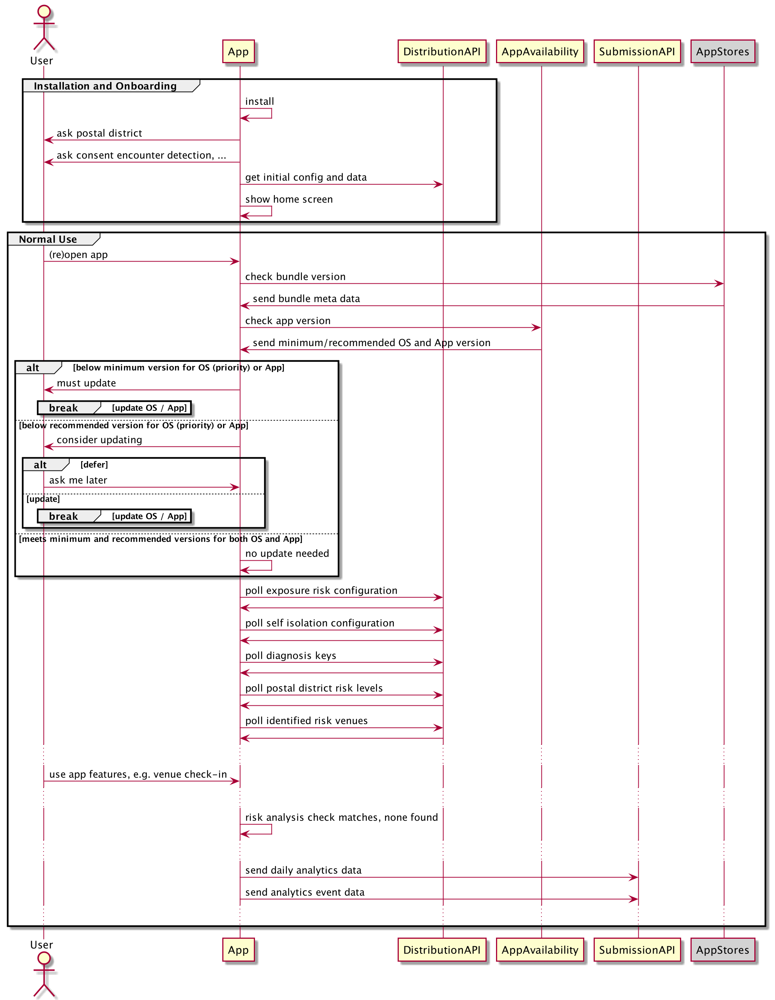
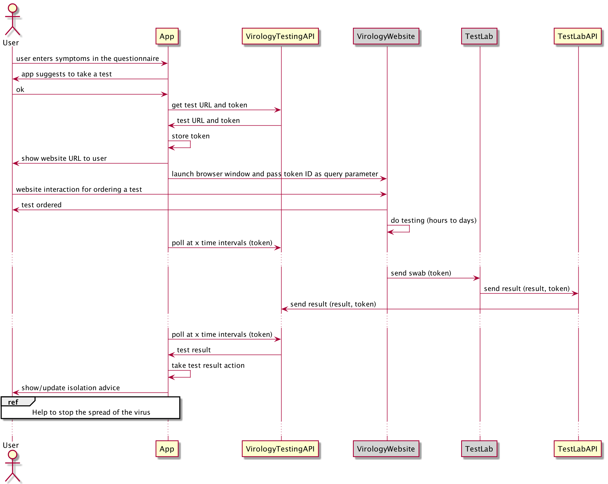
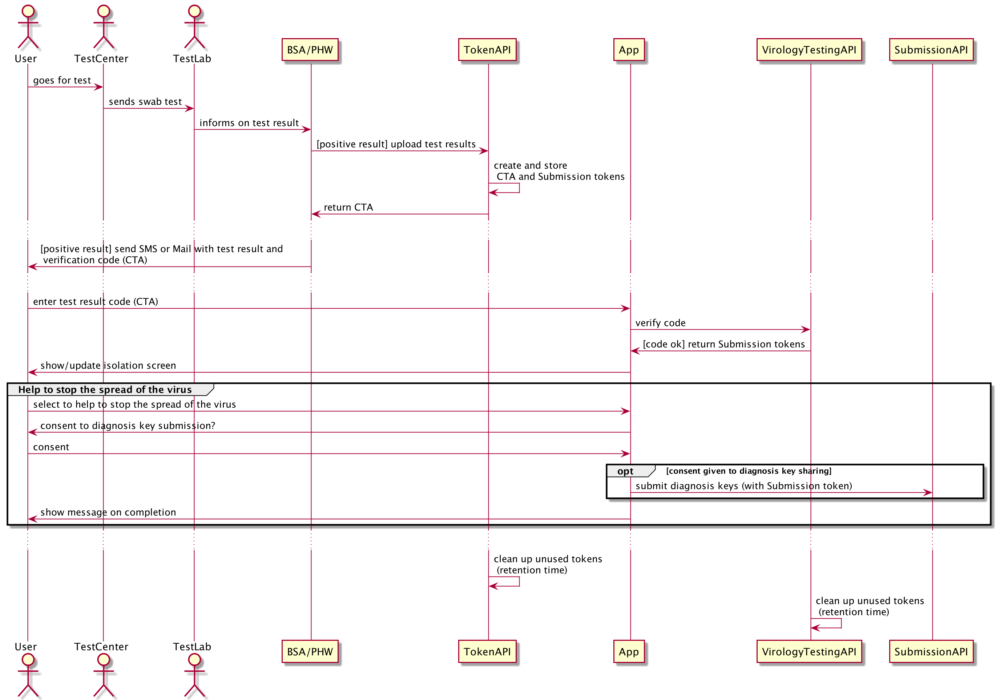

## Key User Journeys

The key user journeys are behavioural interactions between the App, the backend services, the external systems and the monitoring and operation components. They **do not describe interactions within a single system component** such as the actions of the App user within the mobile App itself.

### Installation, configuration and normal use

This is the system flow on first App install, and in normal use when the App is detecting encounters, collecting QR code check-ins, and polling for diagnosis keys, identified risk venues and high-risk postcodes.

On **first install and when the App is opened**, after it has been closed completely on the mobile device, it checks version availability with the backend services as well as the Apple and Google app stores. This check then may notify the user of mandatory or optional available app updates. It also allows the deactivation of all functionality other than the availability check, thereby acting as a kind of temporary "kill switch".

After that, it downloads and applies the following **configuration**:

* Exposure Configuration (Apple Google EN Framework) for encounter detection and exposure risk computation
* Self-Isolation Configuration for isolation time intervals

It then periodically downloads and uses data, retrieved from  **data distribution** APIs:

* Diagnosis Keys
* Postal District Risk Levels
* Identified Risk Venues
* Data and structure for the Symptoms Questionnaire

On a daily basis, the App will submit anonymous **mobile analytics** data:

* Technical static data: OS and App version, and the device model
* Technical dynamic data such as cumulative bytes of data uploaded/downloaded and the number of completed background tasks
* App usage related data on
    * Onboarding
    * Venue Check-Ins
    * Symptoms Questionnaire
    * Test results
    * Isolation

In addition, the App will submit anonymous **mobile analytics events** data to enable AAE to determine the epidemiological effectiveness of encounter detection:
* [ExposureWindow](https://developers.google.com/android/exposure-notifications/exposure-notifications-api#exposurewindow) data

The analytics data is stored in the backend without any reference to the submitting device or App installation.

### Encounter notification and self-isolation

This is the journey where an App User matches the diagnosis keys of a recent contact who has tested positive, and the App may advise self-isolation.

The **risk analysis** is performed by a collection of algorithms within the App, using all available data and configuration from the backend. There is no personal data in the backend that is needed for the risk analysis.

> A **Circuit Breaker** is a backend service to control the propagation of alert or notification decisions, so a scenario where a whole city is told to isolate can be identified and action taken before it occurs.

If risk analysis results in an action trigger, this must be **confirmed with the Circuit Breaker** backend service. This service may need time to decide what action to take.  It needs to see what other App user actions are pending, and to get human operator input so an immediate response is never made. Instead, a short-lived token is generated and returned to the App for it to use to ask for updates. The App periodically polls the server for a decision.

For the Isolation advice, note that no identifiable user state is stored in the backend services. If a user is asked to take action, the only record of this, other than anonymous analytics counters, is on the App itself.

### Reporting symptoms, booking a test and getting the test result

This is the journey where the user reports symptoms, and the App may advise booking a Virology test and facilitate fetching the result.

When the user interacts with the symptoms questionnaire, the App has the latest symptoms configuration and a mapping from symptoms to advice, which is shown to the user. With the advice comes the option to order a test, and a start of the isolation countdown. The countdown is not synchronised with the backend, so if the device is wiped or lost, there is no way to recreate the isolation state.

The testing process involves ordering and registering tests through the external UK Virology Testing website. Note that the step in the flow where the Virology Testing is done is an over-simplification of a complex process external to our system.

The App generates a short-lived token to pass to the Virology Testing website so that it can match the results that come back a few days later. This token is generated by the backend service and is unique. The backend service stores the token so that it can verify any results it is being sent are those expected.

The App will periodically poll the Virology Testing API until the test result is available. 

If the test result is positive, the App user may be asked to self-isolate and prompted to submit their diagnosis keys, for exposure notifications, to help stop the spread of the virus.
If the test result is negative, no further action is needed.

### Receiving a test result via Mail or SMS and entering it manually

This is the journey where a user receives a test result by SMS or Mail, for a test booked outside the App, and the test result token is entered manually into the App so that the test result can be retrieved and actioned in the App.

The notification service, BSA for England and PHW for Wales, uses an App System API to upload the test result **and** to get a test result verification token. This token is then send via SMS/Mail to the citizen together with the test result.  The App user can then verify the test result with the App and submit diagnosis keys, for exposure notifications, to help stop the spread of the virus.

### Checking-in, matching risky venues and notifying the user

Venue check-in and notifications are described in [venues.md](venues.md)

