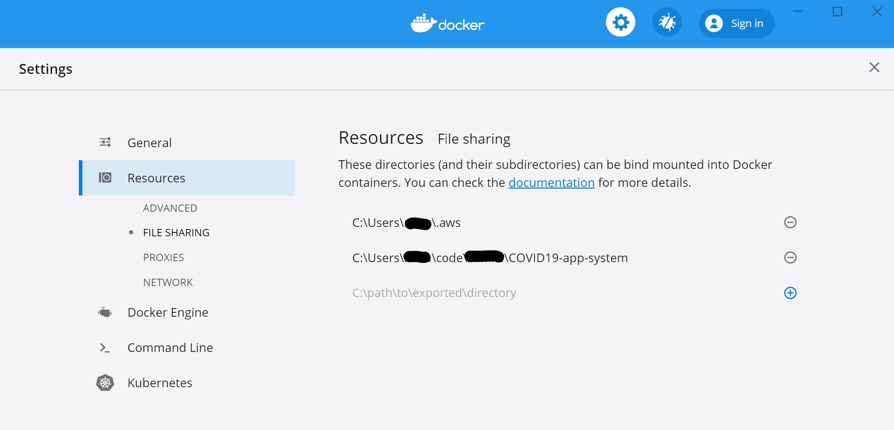

# Dockerized development environment

The container created via the Dockerfile contains all tools required for building, deploying and testing the system locally.
It maps the root of your repository clone into `/workspace` within the container,
and your `~/.aws` folder into `/root/.aws` in the container.
Changes you make to files/folders anywhere else in the container's filespace are not
persisted when you exit the container.

## Convenience tasks

Install and configure Ruby as described in the [environment pre-requisites](../../../doc/env/PROVISION_PREREQS.md)

```bash
rake provision:devenv:pull
```

to pull the docker container image and

```bash
rake devenv
```

to run it.

The convenience tasks detect AWS credentials and automatically configure them in the container. They also mount the correct volumes into the container.

They look for the credentials file created with ```aws configure``` and if not present for the AWS_ACCESS_KEY_ID and AWS_SECRET_ACCESS_KEY environment variables. You can also control which AWS profile to use with the AWS_PROFILE environment variable.

### AWS CLI with Multi-Factor Authentication (MFA)

The Dockerfile contains a tool for switching to different environments
by using the `aws-mfa` command. See the
[HowTo](../../../doc/howto/MFASetup.md) for setup instructions.

You can use Rake to log on to the different accounts:
```
rake login:staging
```
or
```
rake login:prod
```
By default, the role you are logged into is `ApplicationDeploymentUser`.
You can control the choice of role by setting the environment variable
`AWS_ROLE` to either `read` or `deploy` before running the above command.

## Notes for Docker for Windows

- In order to be able to start Docker, make sure you have [Hyper-V enabled](https://docs.microsoft.com/en-us/virtualization/hyper-v-on-windows/quick-start/enable-hyper-v) and running.
In case you use Intel HAXM for virtualization (i.e. Android Virtual Devices use Intel HAXM), when Hyper-V is running, Intel HAXM is not able to start a virtual device, so Hyper-V needs to be turned off and the machine restarted.

- If you get an error running `rake devenv` stating _"Filesharing has been cancelled"_, open Docker for Windows and navigate to **Settings** > **Resources** > **File Sharing**. Add the path to  `C:\Users\<USERNAME>\.aws` and path to this source code on your workstation ([reference](https://docs.docker.com/docker-for-windows/#file-sharing))


